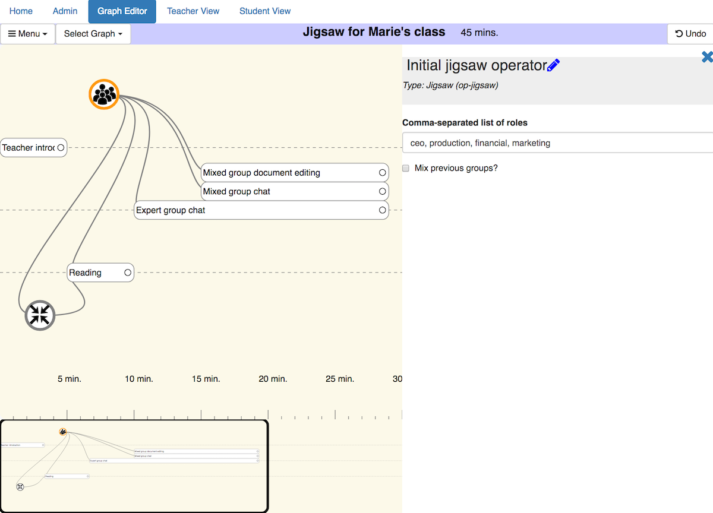
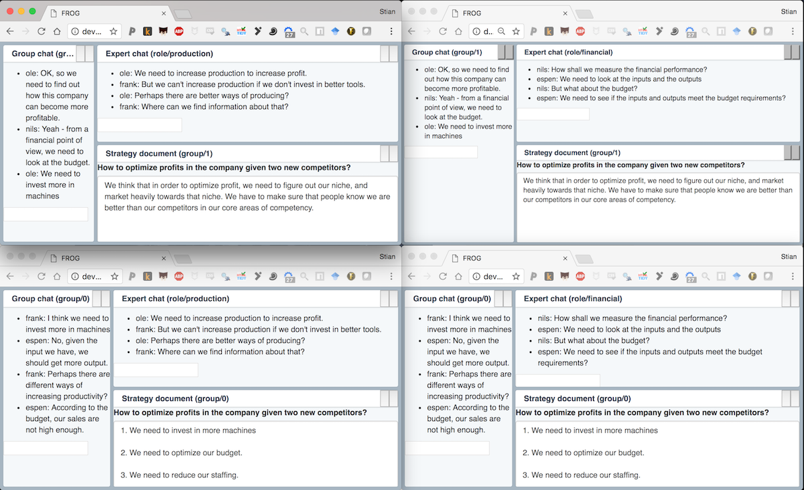

# FROG

Fabricating and running orchestration graphs. To learn more about the design and
architecture, visit our [wiki](https://github.com/chili-epfl/FROG/wiki).

* **[How to install](#set-up)**
* **[Development](#development)**
* **[Licensing](#licensing)**

## Videos

* [Installation and initial setup
  (3:21)](https://www.youtube.com/watch?v=QutJR7W5ib8)
* [Preview functionality
  (10:49)](https://www.youtube.com/watch?v=HQDD8-T4ilU&t=18s)
* [How to use the graph editor and teacher orchestration view
  (17:25)](https://www.youtube.com/watch?v=GOsFwaKBFvs&feature=youtu.be)

## Graph editor
Note that there are some bugs with the graph editor on Firefox (#717) which we will attempt to fix. In the meantime, Chrome is the recommended browser. PRs to improve compatibility with other browsers are welcome.



## Example of student screens (four different students)



## Short video demo

[](https://www.youtube.com/watch?v=dqyjHpnAay0)

(more examples, and videos, on the
[wiki](https://github.com/chili-epfl/FROG/wiki))

## Branches

Note that all active development happens on `develop`, and all pull requests
should be based on this branch. `master` is a stable branch, where we will
attempt to make no API changes until December 2017. We will attempt to fix bugs,
and might add some features or packages, where this does not introduce
backward-incompatibility.

## Set up

* install [Meteor](https://www.meteor.com/install)
* make sure you have a recent version of Node 8 (if you have node, but not the
  latest, you can try `npm install -g n; n latest`

* run the commands

  * `./initial_setup.sh` (if problem occur with bcrypt you can try to run
    `meteor npm install --python=python2.7` from the `frog/` directory)
  * start `./run_and_watch_all.sh`, which watches all dependencies for changes,
    and recompiles with Babel
  * go to the `frog/` directory and run `meteor`

* Go to http://localhost:3000/ on your browser

### Troubleshooting initial setup

* Make sure Meteor works (`meteor --version`) (note that the Meteor version is
  not important, Meteor will automatically download and install the correct
  version when run the first time)
* Make sure you have an up-to-date version of Node 8 (`node --version`), and
  that `npm` works (`npm --version` -- will not be the same as the Node version)
* We do not support Windows - you might be able to get it to run, but all of our
  scripts etc, presume OSX/Linux
* All scripts (`./initial_setup.sh` etc should be run as user, not root)
* If you are running in a virtual machine, and the `./initial_setup.sh` script
  crashes the machine, or does not complete, try removing the parallelism from
  `./initial_setup_wo_meteor.sh` (the `&`s, but not the `&&`s).
* Make sure you have enough disk-space, and that no other processes are
  listening to ports 3000, 3001 and 3002.
* If you need to re-run `./initial_setup.sh`, execute these commands first.
  **(Note that this deletes any file that has not been checked in and
  committed)**: `git reset --hard; git clean -fdx; ./initial_setup.sh`
* Some warnings when you start Meteor like missing `bcrypt`, `hiredis` etc are
  OK, as long as the final lines are:

```
=> Started your app.

=> App running at: http://localhost:3000/
```

## Development

* Learn Meteor framework with React:
  https://www.meteor.com/tutorials/react/creating-an-app

* Use `./run_and_watch_all.sh` to automatically have packages rebuilt after
  editing them (otherwise your changes will not be picked up by Meteor)
* Note that we use `yarn` extensively. In all other directories than in the main
  `./frog` application, you should only use `yarn add` to install packages (not
  `npm install --save`). In `./frog`, you should use `meteor npm install
  --save`. If you see lot's of error messages about missing dependencies etc,
  commit your changes to Git, and run `git reset --hard; git clean -fdx;
  ./initial_setup.sh` from the root directory again. (This will remove any
  changes not committed to Git!)

* In development mode, you can use the URL shorthand `<host>?login={user}` to
  automatically login as a given user (which will be automatically created if it
  does not yet exist). For example, `http://localhost:3000?login=peter`, will
  open the student view logged in as peter. The user 'teacher' has access to the
  graph editor and the teacher orchestration dashboard.
* However, if you open a number of windows in the same browser, they will all be
  logged in as the latest user, because of cookies. A way around this is to add
  entries like this in /etc/hosts:

      127.0.0.1	localhost
      127.0.0.1	dev1
      127.0.0.1	dev2
      127.0.0.1	dev3

Reload `/etc/hosts` (on
[OSX](https://superuser.com/questions/346518/how-do-i-refresh-the-hosts-file-on-os-x)),
and then log in to different users on different "domains".

## Code style/testing

* We use [prettier](https://github.com/prettier/prettier) for Javascript
  formatting, all pull-requests must be formatted accordingly.
* We use ESLint for testing syntax.
* We use Jest for tests.
* We use Flow for type checking.

All PRs should pass all tests (`npm run test` in the repository root directory).

## Licensing

The main FROG program (in the frog/ directory) is licensed under the [GNU Affero
General Public License 3.0](https://www.gnu.org/licenses/agpl-3.0.en.html) (or,
at your option, a later version). The licenses of all other packages may be
found in their respective directories (LICENSE files in each sub-directory).
While the main application is AGPL, we generally license more broadly applicable
libraries, as well as specific learning activities, under permissive licenses
such as the [ISC
license](https://www.isc.org/downloads/software-support-policy/isc-license/) to
facilitate their reuse in other systems. Please [Contact
us](mailto:shaklev@gmail.com) if you have any questions about licensing.
